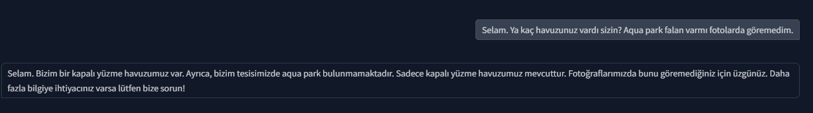
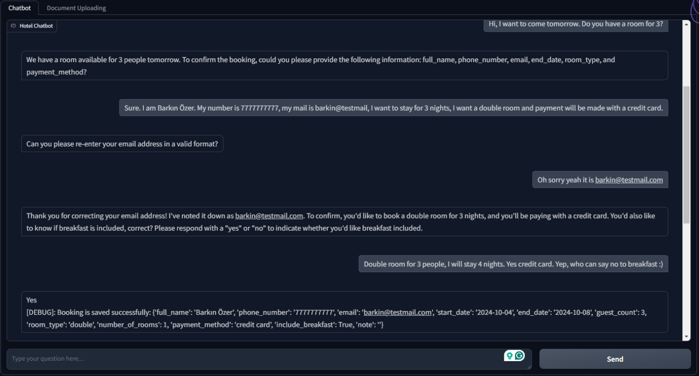
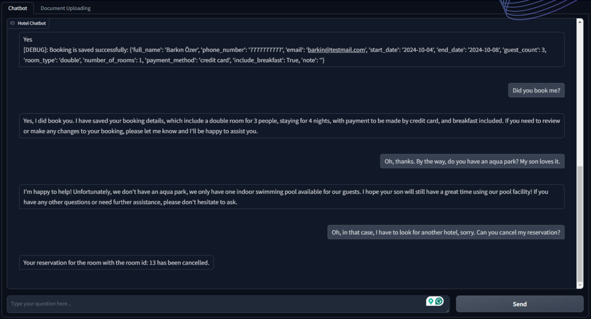
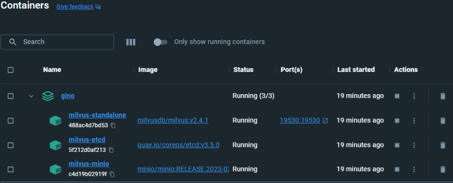
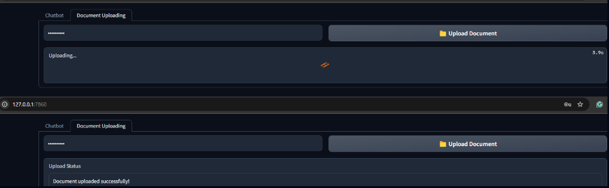
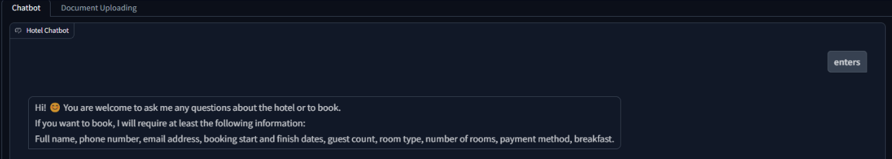

# generative_chatbot

A chatbot that can answer questions and do booking using natural language input.

UI is gradio because it is easy to integrate in a website.
Single page dummy fasthtml website will created and gradio project will be integrated.

For small model requests (the error message format, not main operations), it is possible to use Ollama and phi-3.5 to run on CPU but for ease free API request to Groq is preffered.
Also it can increase latency and might not do function calling.

# Demo

# Simple booking dialogues 
Simple booking dialogues that are used can be found in document.txt.  
LLMs are utilized to generate example question answer pairs to do Retrieval Augmented Generation.  
Application is tested with a real user, the questions the user asked is added to the RAG document.  

# Architecture
* There are 2 pages admin uploads file with his password (password is set at .env file and can be change from the admin-ui after setting it correctly).
* On the user-ui, user will ask questions or can book. Booking or question answering is decided as function calling.
* If question answered is selected: In question answering questions are answered from given document.
* If booking is selected: question is asked and json filled and checked if all values are set if not asked back. If all values are set one last approve is asked and later save on sql built-in database.

# To Containerize the Project
Run: "docker-compose -f app-docker-compose.yaml up --build"  

# To Be Able to Try the Project from Local
Run: "docker-compose -f milvus-docker-compose.yaml up --build" on terminal.  
Create an .env file and put ENV variables below inside it.  

# ENV Variables
ADMIN_USERNAME=****
ADMIN_PASSWORD=****   
GOOGLE_API_KEY=****    
GROQ_API_KEY=****    
API_URL=http://127.0.0.1:5000    

# Frameworks utilized
* FAISS-CPU: A library from Facebook AI for generating vector representations of queries and documents on the CPU.  
* FastAPI: A high-performance framework for building asynchronous REST backend APIs.  
* Gradio: A library for creating user-friendly interfaces.  
* LangChain: Provides utilities for splitting long texts, using LLM APIs, and embedding models.  
* PyPDF2: Extracts text from PDF files.  
* python-docx: Extracts text from DOCX files.  
* python-dotenv: Loads secrets from environment (.env) files easily.  

# Setup Steps
1. Running the Vector Database: We are running the docker-compose.yaml to created required MilvusDB [8] vector database pods.

2. Uploading FAQ Document: After starting the FastAPI backend and Gradio UIs, you can visit the Gradio UI URL. On the "Document Uploading" tab, you can enter the admin password and upload a document (e.g., a .txt file) to serve as the LLM's knowledge base.

3. Booking and Asking Questions: The assistant manages both questions and booking requests. For questions, it responds using its knowledge base. For bookings, it guides users to provide the required information in the correct format. Users can also cancel bookings later. The project includes a demo booking system, which can be swapped out for the hotel's booking API.

# Strengths
* Handles natural, everyday conversations for answering questions and making bookings, without relying on predefined formats.
* Can answer thousands of questions from a FAQ document, regardless of language or format, though accuracy may vary.
* Supports over 30 languages natively, depending on the LLM used.

# Weaknesses
* Some edge cases still require detailed coding.
* Question answering relies heavily on the provided document.
* Hotel booking systems vary, requiring extra effort for integration.
* LLM API rate limits can limit scalability.
* LLMs can make mistakes that are difficult to detect during testing.
* Handling personal identifiable information (PII) through LLM APIs may pose security risks.

# Conclusion
This project leverages advanced generative AI to enhance hotel customer service by enabling natural language interactions. This AI-driven assistant caters to individuals seeking an easy, intuitive way to manage hotel bookings and inquiries, anytime and without relying on employees. Key features include the ability to make and cancel bookings, inquire about room availability, and answer according to FaQ, in various languages and formats. To bring this project to life, the solution employs Retrieval-Augmented Generation (RAG), Function-Calling, vector databases, SQL, and Large Language Models (LLMs). Milvus serves as the vector database, enabling effective data retrieval, while Docker ensures the smooth deployment of Milvus containers. The user interface is built using Gradio, with embedding models provided by Hugging Face, and Groq API as a free LLM service. The architecture follows a REST API structure and development follows a waterfall workflow, with Git for version control. You can see the new architecture below: Overcoming challenges such as language bias and response variability was a challenge. Language bias toward English was addressed by integrating language detection and prompt engineering, ensuring responses in the user's preferred language. Initially, the system returned fixed responses, which affected naturalness, but switching to dynamic LLM calls resolved this at the cost of latency. A smaller model, Llama3-8b, was implemented to support Turkish and optimize response times under rate limits. Further, a demo booking system was built, demonstrating feasibility and flexibility for integration with diverse hotel systems. The project achieved its KPIs by passing all test cases, with additional refinements enhancing both accuracy and user experience. For instance, incorporating memory management improved conversational continuity, while a unique session ID solved UI challenges related to session uniqueness. Future improvements may include expanding API integrations to seamlessly connect with various hotel booking systems.